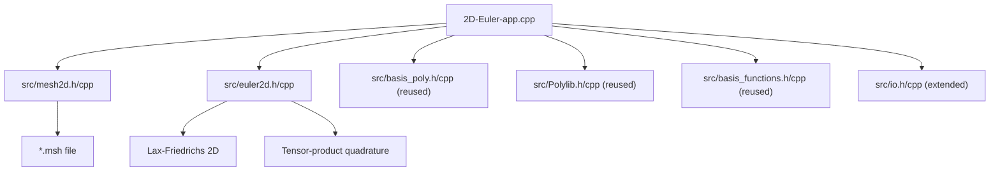

# 2D Compressible Euler DG Solver on Quadrilateral Meshes

## Overview

Extend the 1D DG Euler solver to 2D, targeting unstructured quadrilateral meshes read from GMSH files. The solver will use tensor-product basis functions (reusing the existing 1D Polylib/basis infrastructure), a weak DG formulation, Lax-Friedrichs numerical flux, and RK4 time integration. LibTorch will be dropped; only BLAS/LAPACK is required.

## Architecture

The 2D solver will be a new application alongside the existing 1D code, reusing the `src/` library. New files will be added under `src/` for 2D-specific functionality.




## Key Components

### 1. GMSH Mesh Reader (`src/mesh2d.h`, `src/mesh2d.cpp`)

Read GMSH `.msh` format (v2.2 ASCII is simplest and most widely supported). Store:

- **Nodes**: coordinates `(x, y)` indexed by global node ID
- **Elements**: quad element connectivity (4 node IDs per element)
- **Faces/Edges**: interior faces and boundary faces, with left/right element indices
- **Boundary groups**: physical group IDs from GMSH for applying boundary conditions
- **Element-to-element connectivity**: which elements share which face, and the local face index on each side

Key data structure:

```cpp
struct Mesh2D {
    int nNodes, nElements, nFaces;
    std::vector<std::array<double, 2>> nodes;        // (x, y) per node
    std::vector<std::array<int, 4>> elements;         // 4 node IDs per quad
    struct Face {
        int elemL, elemR;       // left/right element (-1 for boundary)
        int faceL, faceR;       // local face index on each element
        std::array<int, 2> nodeIDs; // the two nodes forming the edge
        int bcType;             // boundary condition type (0=interior)
    };
    std::vector<Face> faces;
};
```

### 2. 2D Reference Element and Tensor-Product Basis

The reference quad is `[-1,1]^2`. The 2D basis is a tensor product of 1D bases:

`phi_{ij}(xi, eta) = phi_i(xi) * phi_j(eta)`

This reuses the existing `BasisPoly` class (Modal or Nodal) and `Polylib` quadrature. For a polynomial order P, there are `(P+1)^2` modes per element.

2D quadrature points are tensor products of 1D Gauss-Legendre (or GLL) points: `nq_2d = nq_1d * nq_1d` points per element.

For face integrals, 1D quadrature rules are used along each edge, with the appropriate coordinate frozen at +/-1.

### 3. Geometry / Jacobian Computation (`src/geom2d.h`, `src/geom2d.cpp`)

For each element, compute the mapping from reference `(xi, eta)` to physical `(x, y)`:

```
x(xi, eta) = sum_k N_k(xi, eta) * x_k
y(xi, eta) = sum_k N_k(xi, eta) * y_k
```

**Initial implementation**: `N_k` are the 4 bilinear shape functions for a straight-sided quad.

**Designed for extensibility to curved elements**: The code will be structured so that:

- Each element stores a variable number of geometry nodes (initially 4, extensible to 9, 16, etc.)
- The shape function evaluation is abstracted into a function that takes the geometry order as a parameter
- The Jacobian is evaluated at each quadrature point (not assumed constant), so the same code path works for both straight and curved elements

Compute at each quadrature point:

- Jacobian matrix `J = [[dx/dxi, dx/deta], [dy/dxi, dy/deta]]`
- `det(J)`
- Inverse Jacobian `J^{-1}` for gradient transformation

For faces: compute outward normal vector and face Jacobian `|J_face|` at each 1D quadrature point along the edge. To upgrade to curved elements later, only the shape functions `N_k` and the GMSH reader (to parse high-order nodes) need to change.

### 4. 2D Euler Equations (`src/euler2d.h`, `src/euler2d.cpp`)

Conservative variables: `U = (rho, rho*u, rho*v, rho*E)` (4 equations).

Physical fluxes:

- `F(U) = (rho*u, rho*u^2+p, rho*u*v, (rho*E+p)*u)` (x-direction)
- `G(U) = (rho*v, rho*u*v, rho*v^2+p, (rho*E+p)*v)` (y-direction)
- `p = (gamma-1)*(rho*E - 0.5*rho*(u^2+v^2))`, gamma=1.4

Normal flux at face: `H(U) = F(U)*nx + G(U)*ny`

Lax-Friedrichs numerical flux extended to 2D:
`H_num = 0.5*(H(U_L) + H(U_R)) - 0.5*alpha*(U_R - U_L)`
where `alpha = max(|v_n| + c)` using Roe-averaged quantities, and `v_n = u*nx + v*ny`.

### 5. DG Weak Formulation and RHS Computation

The semi-discrete DG scheme for element `K`:

`M_K * dU/dt = integral_K (F * d(phi)/dx + G * d(phi)/dy) dA - integral_{dK} H_num * phi dS`

Where:

- **Volume integral**: evaluated using 2D tensor-product quadrature. The gradients `d(phi)/dx`, `d(phi)/dy` are computed via the inverse Jacobian applied to reference-space derivatives `d(phi)/dxi`, `d(phi)/deta`.
- **Surface integral**: evaluated using 1D quadrature on each of the 4 faces. The numerical flux `H_num` is computed using the Riemann solver with left/right traces.
- **Mass matrix** `M_K`: `M_{ij} = integral_K phi_i * phi_j * det(J) dA`. Block-diagonal (one block per element) since DG has no inter-element coupling in the mass matrix. Factored once (LU) and reused.

### 6. Time Integration (RK4)

Reuse the RK4 scheme from the 1D solver, now operating on 4 conservative variables per DOF. CFL-based time step selection should be added for robustness.

### 7. Isentropic Vortex Test Case

Freestream conditions with a superimposed vortex:

- Freestream: `(rho_inf, u_inf, v_inf, p_inf) = (1, 1, 1, 1)`, `gamma = 1.4`
- Vortex perturbation centered at `(x0, y0)`:
  - `du = -beta/(2*pi) * (y-y0) * exp(0.5*(1-r^2))`
  - `dv =  beta/(2*pi) * (x-x0) * exp(0.5*(1-r^2))`
  - `dT = -(gamma-1)*beta^2/(8*gamma*pi^2) * exp(1-r^2)`
  - where `r^2 = (x-x0)^2 + (y-y0)^2`, `beta = 5` (vortex strength)
- Periodic boundary conditions in both directions (domain `[0, 10] x [0, 10]`)
- Exact solution: initial condition advected by `(u_inf, v_inf) * t`

This provides smooth solution for convergence studies (measure L2 error vs exact at final time).

### 8. Input/Output

- Extend `inputs.xml` and `io.h/cpp` to support 2D parameters: mesh file path, test case selection, boundary condition specification.
- Output solution in a format suitable for visualization (VTK or simple text for Python plotting).

### 9. Build System

Update `CMakeLists.txt`:

- Add a separate target `app2d` for the 2D solver
- Remove LibTorch dependency for this target
- Link only BLAS/LAPACK

## File Summary


| Action | File                               | Purpose                                       |
| ------ | ---------------------------------- | --------------------------------------------- |
| New    | `2D-Euler-app.cpp`                 | Main 2D application (init, time loop, output) |
| New    | `src/mesh2d.h`, `src/mesh2d.cpp`   | GMSH quad mesh reader, connectivity           |
| New    | `src/geom2d.h`, `src/geom2d.cpp`   | Jacobian, normals, mappings for 2D quads      |
| New    | `src/euler2d.h`, `src/euler2d.cpp` | 2D Euler fluxes, Riemann solver, RHS          |
| Modify | `src/io.h`, `src/io.cpp`           | Add 2D input parameters                       |
| Modify | `CMakeLists.txt`                   | Add `app2d` target without LibTorch           |
| Reuse  | `src/Polylib.h/cpp`                | 1D quadrature and polynomial evaluation       |
| Reuse  | `src/basis_poly.h/cpp`             | 1D Modal/Nodal basis construction             |
| Reuse  | `src/basis_functions.h/cpp`        | Forward/Backward transforms, mass matrix      |


