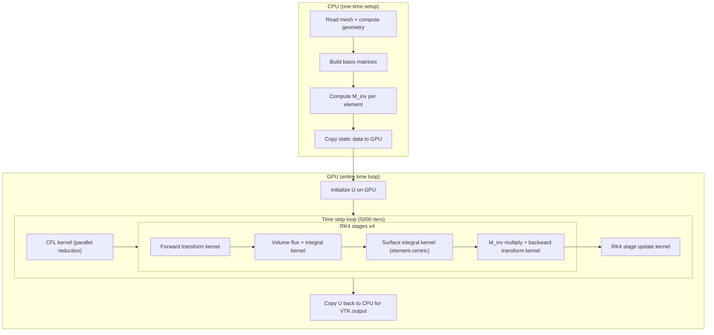

# GPU-Accelerated 2D Euler DG Solver

## Current Performance Profile

The solver runs 5000 RK4 time steps, each calling `computeDGRHS2D` 4 times (20,000 total calls). Each call involves 5 stages over ~4800 quad elements (P=2, nq1d=4, 16 quad pts/elem, 9 modes/elem):

1. **Forward transform** -- project U to modal coefficients via weighted inner products + 9x9 LU solve per element (4 vars)
2. **Volume flux** -- evaluate Euler fluxes at all ~76,800 quad points
3. **Volume integral** -- accumulate flux-weighted basis derivatives into `rhsCoeff`
4. **Surface integral** -- evaluate traces on ~9,600 faces, compute Lax-Friedrichs flux, scatter to `rhsCoeff`
5. **Mass solve + backward transform** -- solve 9x9 system per element, transform coefficients back to quad-point values

All of these are embarrassingly parallel over elements (or faces). Additionally, `computeDt_CFL` scans all quad points for the minimum time step.

## Target Hardware

- **NVIDIA H200** (143 GB HBM3, CUDA 12.8 at `/usr/local/cuda-12.8/`)
- Memory footprint of the solver is < 50 MB, so memory is not a constraint

## Architecture

## Key Design Decisions

### 1. Pre-compute M_inv instead of LU solve on GPU

The current code stores LU-factored mass matrices and calls LAPACK `dgetrs` at runtime. On GPU, a 9x9 matrix-vector multiply (using pre-computed M_inv) is far simpler and faster than an LU solve. We compute M_inv = M^{-1} on the CPU during setup and store it on the GPU.

### 2. Element-centric surface integral (no atomics)

Instead of iterating over faces (which requires atomic writes when two elements share a face), each element processes its own 4 faces. Both neighboring elements redundantly compute the numerical flux for shared faces. This eliminates synchronization at the cost of ~2x redundant flux evaluations on faces -- a worthwhile trade on GPU.

### 3. Data stays on GPU

Solution arrays (`U`, `R`, `k1`-`k4`, `Utmp`, `Ucoeff`, `rhsCoeff`) are allocated on GPU and never transferred back except for VTK I/O. This eliminates per-step PCIe transfers.

### 4. Flatten all 2D arrays to 1D for GPU

The current `std::vector<std::vector<double>>` layout (e.g. `U[var][idx]`) will be flattened to `double* d_U` with layout `d_U[var * totalDOF + idx]` for coalesced GPU memory access.

## Files to Create

- **[src/euler2d_gpu.cuh](src/euler2d_gpu.cuh)** -- Device-side constants, kernel declarations, GPU data structure
- **[src/euler2d_gpu.cu](src/euler2d_gpu.cu)** -- All CUDA kernels and host-side wrapper functions:
  - `allocateGPUData()` / `freeGPUData()` -- memory management
  - `copyStaticDataToGPU()` -- one-time transfer of geometry, basis, M_inv, connectivity
  - `initSolutionOnGPU()` -- set initial condition on device
  - `computeDGRHS2D_GPU()` -- launches the 4 kernels (fwd transform, volume, surface, mass solve)
  - `rk4StageUpdate_GPU()` -- RK4 arithmetic
  - `computeDt_CFL_GPU()` -- parallel min-reduction for CFL time step
  - `copySolutionToHost()` -- device-to-host for VTK output

## Files to Modify

- **[CMakeLists.txt](CMakeLists.txt)** -- Enable CUDA language, add `euler2d_gpu.cu` to `app2d` sources, link CUDA runtime
- **[2D-Euler-app.cpp](2D-Euler-app.cpp)** -- Add `#ifdef __CUDACC_`_ / GPU path:
  - Compute M_inv on CPU after mass matrix assembly
  - Call `allocateGPUData()` and `copyStaticDataToGPU()` before time loop
  - Replace time loop body with GPU kernel calls
  - Call `copySolutionToHost()` before VTK writes
  - The CPU code path remains available as a fallback

## Kernel Thread Configuration

| Kernel               | Grid size          | Block size | Notes                                                 |
| -------------------- | ------------------ | ---------- | ----------------------------------------------------- |
| Forward transform    | nElements          | 256        | 1 block per element, threads cooperate on quad points |
| Volume flux+integral | nElements          | 256        | 1 block per element                                   |
| Surface integral     | nElements          | 128        | 1 block per element, processes 4 faces                |
| M_inv + backward     | nElements          | 256        | 1 block per element                                   |
| RK4 update           | ceil(totalDOF/256) | 256        | 1 thread per DOF                                      |
| CFL reduction        | ceil(totalDOF/256) | 256        | Standard parallel reduction                           |

## Expected Speedup

With ~4800 elements running in parallel on the H200 (132 SMs), the compute-bound portion should see 100-500x speedup. Accounting for kernel launch overhead and memory latency, the overall speedup should be 50-200x, bringing the 14-minute run down to approximately **5-15 seconds**.