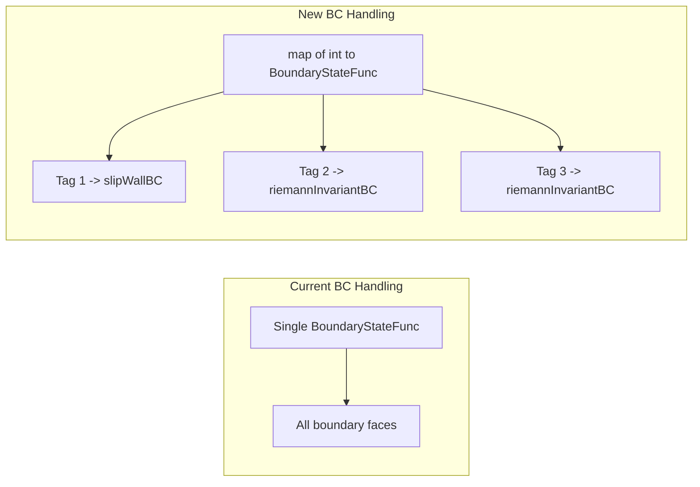

# NACA 0012 Compressible Euler Simulation

## Problem

The solver currently uses a single `BoundaryStateFunc` callback applied uniformly to all boundary faces. For the NACA 0012 case we need different BCs on different physical boundaries:

- **Tag 1 (Airfoil)**: Slip wall (reflect normal velocity)
- **Tag 2 (Farfield)**: Riemann invariant (characteristic-based farfield)
- **Tag 3 (Wake)**: Riemann invariant (same as farfield)

Freestream conditions: M=0.5, AoA=0 degrees, non-dimensionalized (rho=1, p=1/(gamma*M^2)).

## Architecture Change




## Changes

### 1. Update BC callback signature ([src/euler2d.h](src/euler2d.h))

Change the typedef from:

```cpp
typedef void (*BoundaryStateFunc)(double x, double y, double t, double Ubc[NVAR2D]);
```

to:

```cpp
typedef void (*BoundaryStateFunc)(const double UL[NVAR2D], double nx, double ny,
                                   double x, double y, double t, double UR[NVAR2D]);
```

This gives BC functions access to the interior state and outward normal, which slip wall and Riemann invariant BCs both require.

Change `computeDGRHS2D` to accept `const std::map<int, BoundaryStateFunc>& bcMap` instead of a single `BoundaryStateFunc bcFunc`.

### 2. Update boundary loop in `computeDGRHS2D` ([src/euler2d.cpp](src/euler2d.cpp))

In the boundary face section (lines 413-427), look up the face's `bcTag` in the map and call the corresponding function. If no function is found, fall back to `UR = UL`.

```cpp
auto it = bcMap.find(mesh.faces[f].bcTag);
if (it != bcMap.end()) {
    it->second(UL, nx, ny, xf, yf, time, UR);
} else {
    for (int v = 0; v < NVAR2D; ++v) UR[v] = UL[v];
}
```

Note: the normals `nx, ny` are already computed just below the current boundary block (line 431-432). We need to move the normal computation before the BC evaluation, or compute them early for boundary faces.

### 3. Add freestream parameters to Inputs2D ([src/io.h](src/io.h), [src/io.cpp](src/io.cpp))

Add `Mach` and `AoA` fields to the `Inputs2D` struct with defaults (M=0.5, AoA=0). Parse them from XML.

### 4. Implement BCs and test case in [2D-Euler-app.cpp](2D-Euler-app.cpp)

**Slip wall BC** -- reflect the normal velocity component:

```cpp
void slipWallBC(const double UL[NVAR2D], double nx, double ny,
                double, double, double, double UR[NVAR2D]) {
    double rho = UL[0];
    double u = UL[1]/rho, v = UL[2]/rho;
    double Vn = u*nx + v*ny;
    UR[0] = rho;
    UR[1] = rho*(u - 2*Vn*nx);
    UR[2] = rho*(v - 2*Vn*ny);
    UR[3] = UL[3];
}
```

**Riemann invariant farfield BC** -- characteristic-based using Riemann invariants R+ and R-:

- Compute interior normal velocity `Vn_i`, sound speed `c_i`, and Riemann invariants
- Compute freestream normal velocity `Vn_inf`, sound speed `c_inf`
- For subsonic inflow (`Vn_boundary < 0`): use R+ from interior, all other info from freestream
- For subsonic outflow (`Vn_boundary >= 0`): use R- from interior, all other info from interior
- Reconstruct the boundary state from the blended Riemann invariants

**NACA0012 test case initialization**: Uniform freestream everywhere.

**BC map setup**:

```cpp
std::map<int, BoundaryStateFunc> bcMap;
bcMap[1] = slipWallBC;
bcMap[2] = riemannInvariantBC;
bcMap[3] = riemannInvariantBC;
```

Update the existing `IsentropicVortex` test case to use the new callback signature (trivial -- the old `isentropicVortexBC` just ignores UL/normals and sets UR from the exact solution; assign it to all BC tags or pass a single-entry map).

### 5. Create input file `inputs2d_naca.xml`

```xml
<DGSOLVER>
  <PARAMETERS>
    <P> PolynomialOrder = 2 </P>
    <P> nQuadrature = 4 </P>
    <P> CFL = 0.3 </P>
    <P> nt = 5000 </P>
    <P> BasisType = Modal </P>
    <P> PointsType = GaussLegendre </P>
    <P> TimeScheme = RK4 </P>
    <P> MeshFile = naca0012_quad.msh </P>
    <P> TestCase = NACA0012 </P>
    <P> Mach = 0.5 </P>
    <P> AoA = 0.0 </P>
  </PARAMETERS>
</DGSOLVER>
```

### 6. Build and run

```bash
cmake --build build && ./app2d inputs2d_naca.xml
```

